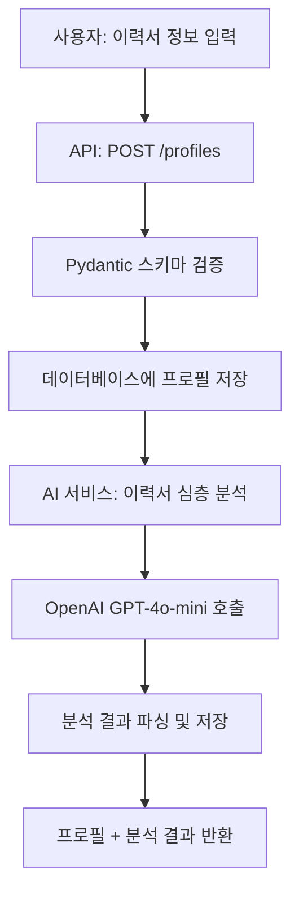
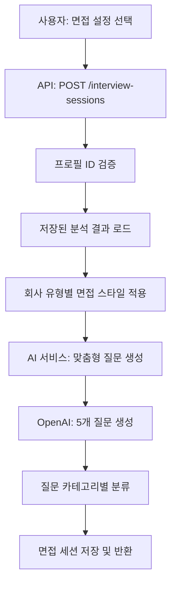
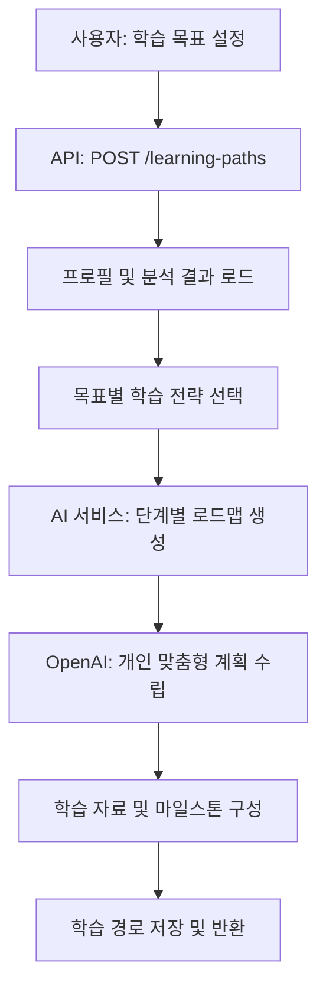

# 🔄 커리어 코치 챗봇 API 동작 플로우

## 📊 **전체 시스템 아키텍처**

```
사용자 요청 → Django Ninja API → AI 서비스 → OpenAI → 데이터베이스 저장 → 응답 반환
```

## 🎯 **단계별 상세 플로우**

### 1️⃣ **이력서 프로필 생성 플로우**



**실제 동작:**
1. **입력 검증**: 경력 요약 최소 10자, 기술 스킬 2개 이상 등
2. **AI 분석**: "20년 경력 헤드헌터" 페르소나로 심층 분석
3. **결과 저장**: 강점/약점/성격 특성/시장 경쟁력 등
4. **캐싱**: 분석 결과를 DB에 저장하여 재사용

### 2️⃣ **면접 질문 생성 플로우**



**차별화 포인트:**
- **회사별 맞춤**: 스타트업 vs 대기업 면접 스타일
- **개인화**: 이력서 분석 기반 맞춤 질문
- **실전성**: 실제 면접에서 나올 법한 심층 질문

### 3️⃣ **학습 경로 생성 플로우**



**특별한 기능:**
- **현실적 계획**: 실제 달성 가능한 3-6개월 로드맵
- **구체적 자료**: 실제 학습 리소스 제공
- **측정 가능**: 명확한 마일스톤과 성과 지표

## 🧠 **AI 프롬프트 엔지니어링 전략**

### 🎭 **역할 기반 페르소나 시스템**

```python
# 예시: 이력서 분석 페르소나
"당신은 20년 경력의 시니어 헤드헌터입니다. 
수천 명의 이력서를 보고 성공/실패 패턴을 파악한 전문가입니다."

# 예시: 면접관 페르소나  
"당신은 {회사유형} 특성을 가진 회사의 {포지션레벨} 면접관입니다."
```

### 🔄 **다단계 프롬프트 체이닝**

1. **1단계**: 이력서 원시 데이터 → 구조화된 분석
2. **2단계**: 분석 결과 + 회사 정보 → 맞춤 질문
3. **3단계**: 분석 + 목표 → 개인화된 학습 경로

### 📊 **컨텍스트 인식 개인화**

```python
# 회사 유형별 차별화
company_styles = {
    "startup": "빠른 성장, 다양한 역할, 문제해결 능력 중시",
    "large": "전문성, 체계적 업무, 협업 능력",
    # ...
}

# 경력 단계별 맞춤화
if experience_years < 2: "신입자 관점"
elif experience_years < 5: "주니어 개발자 관점"
# ...
```

## 🚀 **실제 사용 예시**

### 📝 **Step 1: 프로필 생성**
```bash
curl -X POST "http://localhost:8000/api/profiles" \
  -H "Content-Type: application/json" \
  -d '{
    "career_summary": "3년차 백엔드 개발자, 커머스 서비스 개발 경험",
    "job_role": "Spring Boot 기반 API 서버 개발",
    "technical_skills": "Java, Spring Boot, MySQL, AWS",
    "experience_years": 3
  }'
```

**AI 분석 결과:**
- 커리어 레벨: "주니어-미드 레벨"
- 강점: ["백엔드 전문성", "커머스 도메인 경험"]
- 개선점: ["프론트엔드 이해", "대용량 트래픽 처리"]

### 🎯 **Step 2: 면접 질문 생성**
```bash
curl -X POST "http://localhost:8000/api/interview-sessions" \
  -H "Content-Type: application/json" \
  -d '{
    "profile_id": "생성된_프로필_ID",
    "target_company_type": "startup",
    "target_position_level": "mid"
  }'
```

**생성된 질문 예시:**
1. "커머스 서비스에서 결제 시스템을 설계한다면..."
2. "Spring Boot에서 성능 최적화를 위해 사용한 방법은..."

### 📚 **Step 3: 학습 경로 생성**
```bash
curl -X POST "http://localhost:8000/api/learning-paths" \
  -H "Content-Type: application/json" \
  -d '{
    "profile_id": "생성된_프로필_ID", 
    "target_goal": "skill_enhancement",
    "preferred_duration_months": 3
  }'
```

**생성된 로드맵:**
- 1단계: Spring 심화 (4주)
- 2단계: 대용량 처리 (6주) 
- 3단계: 실전 프로젝트 (2주)

## 📈 **성능 최적화**

### ⚡ **캐싱 전략**
- 이력서 분석 결과 DB 저장
- 중복 분석 방지
- 빠른 응답 시간

### 🔄 **비동기 처리**
- OpenAI API 호출 최적화
- 사용자 경험 개선

### 📊 **모니터링**
- API 응답 시간 추적
- OpenAI 사용량 모니터링
- 에러 로깅 및 알림

---

**🎯 이제 전체 시스템이 어떻게 동작하는지 완전히 이해하셨나요?**
**OpenAI API 키만 설정하면 바로 실제 AI 기능을 체험할 수 있습니다!** 🚀
